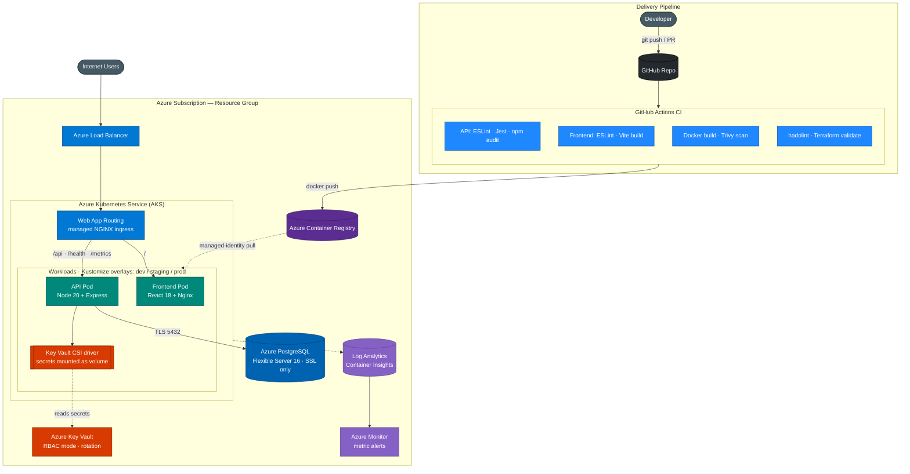

# Cloud-Native Microservices Platform

A three-tier web application (React frontend, Node.js API, PostgreSQL) packaged with the
full deployment toolchain used to ship it: Docker, Kubernetes (Kustomize), Terraform for
Azure, and CI that builds, tests, and image-scans on every push.

[](https://github.com/JaithraSarma/cloud-native-platform/actions/workflows/ci.yml)
[](LICENSE)


## What this is

The application is deliberately small — a products CRUD service — because the subject of
the project is the platform around it, not the business logic. It demonstrates a working
path from source code to a running Azure Kubernetes Service cluster:

- Local development with Docker Compose, plus an optional Prometheus + Grafana stack.
- Container images built as multi-stage, non-root, health-checked builds.
- Kubernetes manifests managed with Kustomize across dev, staging, and prod overlays.
- Azure infrastructure defined in Terraform (AKS, ACR, Key Vault, PostgreSQL, Monitor).
- CI in GitHub Actions: lint, test, image build, Trivy scan, Terraform validation.

Full step-by-step instructions and expected output are in [SETUP.md](SETUP.md).

## Architecture (Azure)



Locally the same three tiers run under Docker Compose on a bridge network, with Nginx
proxying `/api` and `/health` to the API container.

## Tech stack

| Layer | Technology |
|---|---|
| Frontend | React 18, Vite 5, Tailwind CSS 3, served by Nginx 1.25 |
| API | Node.js 20, Express 4 |
| Database | PostgreSQL 16 |
| Containers | Docker multi-stage builds, non-root, HEALTHCHECK |
| Orchestration | Kubernetes (AKS 1.29) with Kustomize overlays |
| Infrastructure | Terraform (`azurerm` provider) |
| CI/CD | GitHub Actions (primary) + Azure DevOps Pipelines (example) |
| Security scanning | Trivy (image), hadolint (Dockerfile), npm audit |
| Metrics | prom-client `/metrics`, Prometheus, Grafana |

## Quick start (local)

Requires Docker Desktop.

```bash
docker compose up --build -d
docker compose ps          # all three services report (healthy)
```

| Service | URL |
|---|---|
| Frontend dashboard | http://localhost:8080 |
| API health | http://localhost:3001/health |
| Products API | http://localhost:3001/api/products |
| Prometheus metrics | http://localhost:3001/metrics |

```bash
docker compose down -v     # stop and remove volumes
```

See [SETUP.md](SETUP.md) for the walkthrough with expected output, the test suite, and
the Azure deployment.

## Observability (optional)

An opt-in Compose profile adds Prometheus and Grafana, pre-provisioned to scrape the API:

```bash
docker compose --profile monitoring up -d
```

| Tool | URL | Notes |
|---|---|---|
| Prometheus | http://localhost:9090 | Scrapes `api:3001/metrics` every 15s |
| Grafana | http://localhost:3000 | Login `admin` / `admin` (local only) |

Grafana loads the "Cloud Platform API — Runtime" dashboard automatically (CPU, memory,
Node heap, event-loop lag, and up/down).

## CI/CD

`.github/workflows/ci.yml` runs on every push and pull request to `main`:

| Job | What it does |
|---|---|
| `api-tests` | `npm ci`, ESLint, Jest (12 tests), `npm audit` |
| `frontend-build` | `npm ci`, ESLint, Vite build |
| `docker-and-scan` | Builds both images, Trivy scan reporting CRITICAL/HIGH (unfixed ignored) |
| `hadolint` | Lints both Dockerfiles |
| `terraform-checks` | `terraform fmt -check`, `init -backend=false`, `validate` |

Dependabot (`.github/dependabot.yml`) opens weekly update PRs for npm, Docker, GitHub
Actions, and Terraform. The `pipelines/` directory holds an equivalent Azure DevOps
pipeline set (CI, CD with gated approvals, and infrastructure) kept as a reference for an
Azure-native toolchain.

## Project structure

```
cloud-native-platform/
├── api/                      # Node.js/Express service
│   ├── src/                  # server.js, db.js, routes/{products,health}.js
│   ├── tests/                # Jest + supertest (DB mocked)
│   └── Dockerfile            # multi-stage, non-root, npm ci
├── frontend/                 # React/Vite dashboard
│   ├── src/                  # App.jsx, main.jsx, index.css
│   ├── nginx.conf            # SPA + /api reverse proxy
│   └── Dockerfile            # build → nginx:alpine
├── k8s/
│   ├── base/                 # namespace, deployments, services, ingress, secret provider
│   └── overlays/             # dev (1 replica), staging (2), prod (3 + HPA + PDB)
├── infra/terraform/          # AKS, ACR, Key Vault, PostgreSQL, Monitor
│   └── environments/         # dev/staging/prod .tfvars
├── pipelines/                # Azure DevOps CI/CD/infra pipelines (example)
├── monitoring/               # Prometheus config + Grafana provisioning/dashboards
├── scripts/                  # setup-azure.sh, teardown.sh, local-dev.sh
├── .github/workflows/ci.yml  # GitHub Actions CI
├── docker-compose.yml        # db + api + frontend, plus monitoring profile
├── Makefile                  # common tasks (make help)
├── README.md
└── SETUP.md                  # implementation guide with expected output
```

## Security

- API: Helmet headers, per-IP rate limiting, express-validator input validation,
  parameterized SQL (no string interpolation), 10 kb JSON body limit.
- Containers: non-root user, pinned Alpine base images, HEALTHCHECK, Trivy scanned in CI.
- Azure: secrets in Key Vault mounted via the CSI driver (never in code or env files),
  RBAC-mode Key Vault, managed-identity ACR pull, SSL-only PostgreSQL.

## License

[MIT](LICENSE) © 2026 Jaithra Sarma
